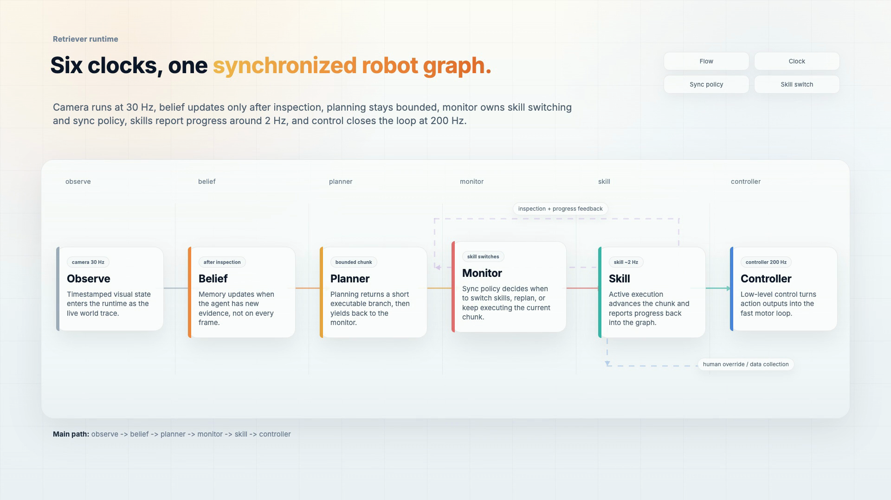

<div class="gr-reference-hero gr-reference-hero-tight">
  <div>
    <p class="gr-eyebrow">Applied Retriever reference</p>
    <h1>Golden examples start where the core quickstart ends.</h1>
    <p class="gr-lede">GoldenRetriever is the maintained applied layer for Retriever: robot-facing examples, reusable payload packs, simulator and visualization lanes, and candidates for future Retriever Hub packs. Learn the runtime once in the core docs; use Golden to see those ideas as runnable robot systems.</p>
  </div>
  <div class="gr-command-strip">
    <span>First Golden proof</span>
    <code>pixi run demo-golden-hub-pack</code>
    <p>Loads Golden robot payload exports through Retriever Hub. No robot, camera, model, simulator, or network dependency is required.</p>
  </div>
</div>

<div class="gr-route-pills gr-route-pills-inline">
  <a href="https://openretriever-docs.pages.dev/">Retriever core docs</a>
  <a href="examples/">Golden examples</a>
  <a href="hub/">Hub packs</a>
  <a href="robotics_typing_standard/">Robot type packs</a>
</div>

!!! note "Golden is not a second runtime"
    Install and learn the runtime once. The Python import package is `retriever`; the public runtime distribution target is `retriever-core`. Golden provides applied examples and pack candidates on top of that runtime, not another Flow/Pipeline implementation.

## How The Retriever Surfaces Fit

<div class="gr-layer-map gr-layer-map-compact">
  <div>
    <span>01 Front door</span>
    <strong>OpenRetriever front door</strong>
    <p>Choose the shortest path: install, visual quickstart, core docs, Golden examples, Hub, or source.</p>
  </div>
  <div>
    <span>02 Core runtime</span>
    <strong>Retriever core docs</strong>
    <p>Learn Flow, Pipeline, clocks, sync policies, stepping, replay, IR, execution, graph rendering, and Hub mechanics.</p>
  </div>
  <div>
    <span>03 Applied reference</span>
    <strong><a href="examples/">Golden examples</a></strong>
    <p>Run robot-facing examples, type packs, simulator wrappers, visualization lanes, and reusable pack candidates.</p>
  </div>
</div>

## Recommended Route

<div class="gr-path-grid gr-path-grid-five">
  <div class="gr-path-step">
    <span>00</span>
    <strong>Run core first</strong>
    <p>Start with the lightweight mock/webcam visual graph so Flow, stepping, graph inspection, and replay are clear.</p>
    <code>pixi run demo-webcam-detection-mock</code>
  </div>
  <a class="gr-path-step" href="examples/golden_hub_packs_v1/">
    <span>01</span>
    <strong>Prove the Golden boundary</strong>
    <p>Load manifest-declared robot payloads through Retriever Hub instead of treating Golden as a runtime fork.</p>
    <code>pixi run demo-golden-hub-pack</code>
  </a>
  <a class="gr-path-step" href="examples/perception_and_memory_v1/">
    <span>02</span>
    <strong>Walk the example ladder</strong>
    <p>Use perception, memory, language, and composition examples over small deterministic robot-facing payloads.</p>
    <code>pixi run -e golden-local demo-perception-detection-flow</code>
  </a>
  <a class="gr-path-step" href="examples/simulation_and_visualization_v1/">
    <span>03</span>
    <strong>Inspect visual systems</strong>
    <p>Move to Rerun, mock-safe robosuite, simulator lanes, and self-contained HTML graph artifacts.</p>
    <code>pixi run demo-pipeline-html-viz</code>
  </a>
  <a class="gr-path-step" href="hub/pack_roadmap_v1/">
    <span>04</span>
    <strong>Promote reusable packs</strong>
    <p>Move examples into Hub-loadable packs only when imports, versions, smokes, dependency tiers, and docs are stable.</p>
    <code>hub.use("openretriever/golden-retriever:WorldState")</code>
  </a>
</div>

## First Results To Recognize

<div class="gr-result-grid gr-result-grid-three">
  <div class="gr-result-card">
    <span>Hub proof</span>
    <strong>Terminal export summary</strong>
    <pre><code>pixi run demo-golden-hub-pack
# Golden pack exports: WorldState, BeliefGraph, Skill, Plan, ...
# Arrow round-trip: Action OK</code></pre>
  </div>
  <div class="gr-result-card">
    <span>Simulator proof</span>
    <strong>Mock-safe environment trace</strong>
    <pre><code>pixi run demo-robosuite-mock
# [mock step=01] object_height=...
# reward=... done=False</code></pre>
  </div>
  <div class="gr-result-card">
    <span>Graph proof</span>
    <strong>Self-contained HTML graph</strong>
    <pre><code>pixi run demo-pipeline-html-viz
# writes out/golden_retriever_closed_loop_viz.html
# prints a compact ASCII graph</code></pre>
  </div>
</div>

<figure class="gr-figure-card gr-figure-card-wide gr-home-figure">
  
  <figcaption><strong>Applied robot graph.</strong> Golden examples make multi-rate robot graphs concrete: camera, belief, planner, monitor, skill, controller, and environment-like Flows keep timing and data handoff boundaries explicit.</figcaption>
</figure>

## What Belongs Here

| Surface | Lives in Golden? | Why |
| --- | --- | --- |
| Flow, Pipeline, clocks, sync, IR, replay, execution | No | These are core runtime semantics and stay in the core Retriever docs. |
| Robot-facing payload packs | Yes | Golden defines applied `WorldState`, `BeliefGraph`, `Plan`, `Trajectory`, command/status, and conversion examples. |
| Perception, memory, language, composition examples | Yes | These are the maintained ladder after the core quickstart. |
| Camera, simulator, visualization, notebook lanes | Yes, with dependency labels | They are useful applied references, but optional lanes should not block the first run. |
| Hub-pack candidates | Yes | Golden is the proving ground before examples become reusable Hub packs. |

## First Commands

Run these from the GoldenRetriever repository after the core quickstart works.

```bash
pixi run demo-golden-hub-pack
pixi run -e golden-local demo-perception-detection-flow
pixi run demo-robosuite-mock
pixi run demo-pipeline-html-viz
pixi run public-surface-check
```

## Continue

<div class="gr-layer-map gr-layer-map-compact">
  <div>
    <span>Examples</span>
    <strong><a href="examples/">Golden Example Catalog</a></strong>
    <p>Command-first guide for perception, memory, language, composition, simulation, visualization, and type-pack lanes.</p>
  </div>
  <div>
    <span>Hub</span>
    <strong><a href="hub/">Retriever Hub Packs</a></strong>
    <p>Pack boundary, current export catalog, and promotion rules for moving source examples into reusable packs.</p>
  </div>
  <div>
    <span>Types</span>
    <strong><a href="robotics_typing_standard/">Robot Type Packs</a></strong>
    <p>World state, belief, skills, plans, commands, statuses, trajectories, event streams, and dataset profiles.</p>
  </div>
</div>
