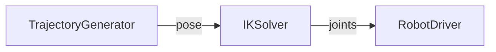

# Native Node Example: Robot IK Solver

This specific example demonstrates a "canonical" use case for native nodes in Retriever: **High-performance Robotics Components**.

We implement a robot **Inverse Kinematics (IK) Solver** in 3 languages, all compatible with the same Python pipeline.

## The Architecture

The pipeline is simple and representative of a real control loop:



- **Objective**: Convert end-effector pose (x,y,z,r,p,y) -> joint angles (j1-j6).
- **Why Native?**: functionality like IK solvers, Computer Vision, or MPC (Model Predictive Control) often relies on C++ libraries (KDL, Pinocchio, OpenCV) or require Rust's real-time guarantees.

## Run The Example

Requires `pixi` for environment management.

### 1. Python Implementation (Baseline)
Pure Python. Good for prototyping.
```bash
pixi run binding-controller-python
```

### 2. Rust Implementation
Uses `dora-node-api`. compiled via `cargo`.
```bash
# Build & Run using pixi task
pixi run -e rust binding-controller-rust
```

### 3. C++ Implementation
Uses C++ dataflow API. compiled via `cmake`.
```bash
# Build & Run using pixi task
pixi run -e cpp binding-controller-cpp
```

## How It Works

The `app.py` script is simply a Python Retriever pipeline. We swap the implementation of the `IKSolver` node at runtime:

```python
# app.py

# 1. Define the Python Interface
class IKSolver(Flow[TargetPose, JointAngles]):
    def run(self, input):
        # Python fallback/prototype logic
        ...

# 2. Add Native Override (if requested)
overrides = {}
if backend == "rust":
    overrides["IKSolver"] = "target/release/rust-controller"

# 3. Run Pipeline
retriever.run(..., native_overrides=overrides)
```

## Data Format

We use **Apache Arrow** for zero-copy data exchange.
- **Python**: send/receive `numpy.ndarray` (float32)
- **Rust/C++**: receive raw bytes (casting to `float*` or `Vec<f32>`).

This avoids expensive pickling/serialization overhead.
