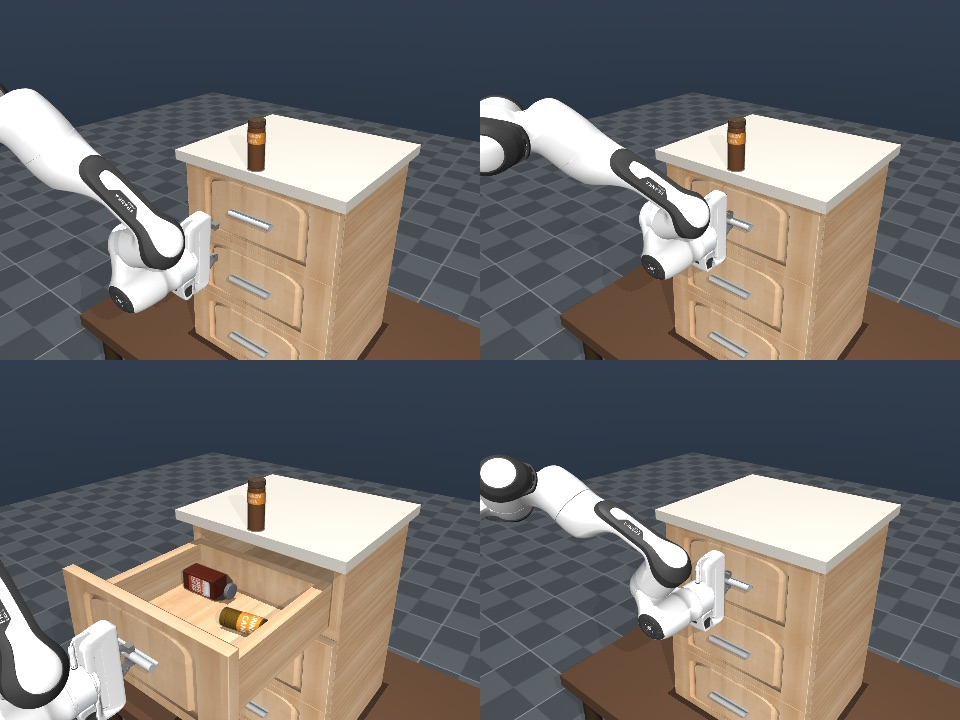

# RoboCasa drawer: an arm that seasons a plated meal

A MuJoCo scene built from RoboCasa parts — a three-drawer dresser standing on a
table, its top drawer a spice drawer with four scanned seasoning containers
standing in it, a plate of steak and broccoli on the table in front of it — and
a Panda on an Omron mobile base, the same robot RoboCasa's own kitchen tasks
drive.

The robot opens the top drawer by its handle, takes the pepper shaker out of it,
brings it down over the plate, tips it cap-down and shakes it over the food,
puts it back where it came from, and pushes the drawer shut. Nothing is scripted
at the joint level and nothing is attached: the drawer moves only while the
fingers are on its handle, and the shaker moves only while they are around it.



## 1. Mock-safe contract

Run this first. It needs no simulator, no assets, no GPU and no network:

```bash
pixi run demo-drawer-mock
```

Expected output — the thirty phases in order, the drawer travelling only while
the handle is held, the shaker turning cap-down only while it is held, and a
successful finish:

```text
[mock step=0010] phase=close in               drawer=0.000m holding=nothing tip=  0deg progress=7.8% success=False
[mock step=0020] phase=let go of the handle   drawer=0.220m holding=nothing tip=  0deg progress=17.5% success=False
[mock step=0030] phase=over the shaker        drawer=0.220m holding=nothing tip=  0deg progress=27.3% success=False
[mock step=0040] phase=out over the plate     drawer=0.220m holding=shaker  tip=  0deg progress=37.0% success=False
[mock step=0050] phase=tip it over the food   drawer=0.220m holding=shaker  tip=117deg progress=46.8% success=False
[mock step=0060] phase=bring it upright       drawer=0.220m holding=shaker  tip= 18deg progress=56.5% success=False
[mock step=0070] phase=back over the drawer   drawer=0.220m holding=shaker  tip=  0deg progress=66.3% success=False
[mock step=0080] phase=swing to the front     drawer=0.220m holding=nothing tip=  0deg progress=76.0% success=False
[mock step=0090] phase=grip the handle again  drawer=0.220m holding=handle  tip=  0deg progress=85.8% success=False
[mock step=0100] phase=back off               drawer=0.000m holding=nothing tip=  0deg progress=95.5% success=False

routine complete: peak drawer travel 0.220 m (needs >= 0.18), shut to 0.000 m
(needs <= 0.02), seasoned=True, shaker back in the drawer=True, 30 phases over
51.3 s -> success=True
```

The mock reproduces the timeline, the commanded travel, the commanded roll and
the pass thresholds. It does not reproduce contact: only the MuJoCo lane can
show that the *grasps* are what move the drawer and the shaker, and `verify.py`
is what asserts it.

## 2. The interactive viewer

From a fresh clone. The asset download is ~5 GB and is only ever run once:

```bash
# The Pixi environment ships `uv`, not `pip`.
pixi run uv pip install -e ".[robocasa_drawer]"

# RoboCasa is not on PyPI, and RoboSuite has to come from source too: RoboCasa
# calls `mjcf_utils.get_elements`, which landed after the 1.5.1 release on PyPI.
# Install the extra first, so these two only swap the code and keep the deps.
git clone --depth 1 https://github.com/ARISE-Initiative/robosuite.git ../robosuite
pixi run uv pip install -e ../robosuite --no-deps

# `--no-deps` on RoboCasa as well: its pinned tianshou drags in an old gym, and
# `requirements.txt` is only `-e .`, so it re-triggers the same pins. These are
# its real dependencies for this scene.
git clone https://github.com/robocasa/robocasa.git ../robocasa
pixi run uv pip install -e ../robocasa --no-deps
pixi run uv pip install "numpy==2.2.5" numba scipy "mujoco==3.3.1" pygame Pillow \
  opencv-python pyyaml pynput tqdm termcolor imageio imageio-ffmpeg h5py lxml \
  hidapi gymnasium

pixi run demo-drawer-assets   # ~5 GB, once; answer `y` at the prompt
pixi run demo-drawer          # builds scene.xml, opens the browser
```

Clone RoboSuite and RoboCasa as siblings of the repo, not inside it, or they
turn up in `git status`.

`demo-drawer` is the browser demo: it builds `scene.xml` itself on first run,
opens the page for you, parks the camera on the scene's own `action` view, and
streams the live simulation. It runs under plain
`python` — no `mjpython`, no native window. Pass `-- --no-open` to serve without
opening a browser, `-- --port 9000` to move it, `-- --hold` to start paused.

Geoms whose material carries a colour map go over as textured glTF, so the wood,
the labelled jars and the food arrive looking like themselves; everything else
goes as a flat mesh in its material colour. Pass `-- --flat` to skip the
textures altogether — it starts a second or so faster and is the fallback if a
scan will not map.

Its "routine" panel is the point of the thing: **holding handle** and **holding
shaker** read `yes` or `no` tick by tick, and when they read `no` nothing moves,
because nothing else in the scene can move either object. **shaker tipped**
passes 90 degrees only while the seasoning is being shaken over the food.
`restart routine` resets to the home keyframe; unticking `run routine` parks the
arm at its home pose.

The assets are fetched by the task above, which wraps
`robocasa.scripts.download_kitchen_assets`; this scene needs `tex` for the
carcass finish, `fixtures_lw` for the cabinet panels and handles, `objs_lw` for
the seasoning containers, and `objs_objaverse` for the plate and the food on it.
It does not need `tex_generative` or `objs_aigen`, which is most of the rest of
the ~19 GB asset set.

If disk is tight, the three objaverse instances this scene actually uses can be
pulled on their own instead of the whole 2.2 GB pack:

```bash
A=$(python -c "import robocasa, pathlib; print(pathlib.Path(robocasa.__file__).parent / 'models/assets/objects')")
curl -sL "https://utexas.box.com/shared/static/03eionyo8fk3a9dsksq9jb8du5lqfw8h.zip" \
  | bsdtar -xf - -C "$A" \
    --include='objaverse/plate/plate_0/*' \
    --include='objaverse/steak/steak_3/*' \
    --include='objaverse/broccoli/broccoli_0/*'
```

### Why not mjviser

`mjviser` is the obvious way to put a MuJoCo model in a viser page, and it is
what an earlier draft of this scene used. It requires `mujoco>=3.6`, but
RoboSuite's controllers do not survive the `mj_fullM` signature change in 3.10,
and `scene.py` needs RoboSuite to build the robot at all — so this example is
pinned to `mujoco==3.3.1` and talks to viser directly instead. `viewer.py`
pushes each visual geom once as a triangle mesh and then moves it per frame.

Two conventions bite when the textures go across. A geom that never mentions
`rgba` keeps the MuJoCo compiler's default grey, and reading that instead of the
material painted the whole kitchen grey; the material has to win unless the geom
actually overrides it. And MuJoCo hands out texcoords in glTF's own top-left
convention while trimesh flips V as it writes the glB, so `viewer.py` pre-flips
to cancel that out — without it every label arrives upside down.

## 3. The other simulator lanes

```bash
pixi run demo-drawer-flow     # the routine, through Retriever Flows
pixi run demo-drawer-verify   # the assertions, headless
pixi run demo-drawer-scene    # rebuild scene.xml explicitly
```

`scene.xml` is generated, not committed: it references the mesh and texture
files by absolute path inside your RoboCasa install, so it is only valid on the
machine that built it.

## What the robot actually does

Two grasps, and neither the thing being grasped is driven.

**The drawer slide joints carry no actuator** — they are passive and damped, so
the drawer physically cannot open unless something takes hold of it. The routine
squares up to the handle bar, closes the fingers across it, and drives the
*hand* out along -y for 22 cm. The drawer comes because the fingers are on it.

**The pepper shaker has no actuator either** — it is a free body standing on the
drawer floor, one of four. It only reaches the plate because the gripper carries
it there, and it only gets back into the drawer because the gripper puts it
back.

That is also the check. `verify.py` asserts, first, that no actuator acts on a
slide joint and none acts on the shaker; then that a finger pad is in contact
with the handle for 100% of the pull and push and with the shaker for 100% of
the excursion. Take either grasp away and nothing moves and the run fails.

The two grasps need different gripper poses, which is why this needs orientation
control and not just a reach:

- The handle is a cylinder lying along world x, standing about 8 mm proud of the
  drawer front, so the fingers have to close **vertically** across it — the
  approach axis pointing at the drawer, the closing axis straight up.
- The shaker stands upright, so the fingers close **horizontally** around it —
  approach axis straight down. It is gripped at its waist, 30 mm across against
  48 mm at its base, so the grip is a form fit rather than pure friction.

Tipping the shaker over the plate is then a roll about the closing axis: the
fingers keep their hold and the shaker turns over with them, cap downwards.

`arm_control.py` does one damped least-squares step per tick against the full
6-row site Jacobian — position and orientation together — integrated into
position-actuator targets.

## The five things that had to be right

Three are about driving the robot at all:

- robosuite ships the Panda with direct-torque motors because its own
  controllers compute the torques. Nothing here runs a robosuite controller, so
  `scene.py` swaps them for position actuators; without that the arm collapses.
- The two finger joints run in **opposite** directions — joint1 is `[0, 0.04]`,
  joint2 is `[-0.04, 0]`. Commanding both the same way drives them to the same
  side and the gripper never closes on anything.
- The fingers have to stall against an 18 mm bar and still hold it, so their
  gain is 8000 with a 100 N force limit. At the default 120 the grip was worth
  about a newton and the handle slid straight out. The shaker is commanded to a
  gentler 12 mm rather than fully closed.

Two more that the seasoning task needed:

- **Seven joints against a six-row task leaves one spare, and it has to be
  spent.** `arm_control.py` adds a posture term in the Jacobian's nullspace that
  backs every joint away from its stop. Without it the arm arrives at the plate
  with the shoulder pinned at its limit and then cannot tip the shaker over at
  all — the roll simply stops at 60 degrees. The nullspace projector uses a
  lighter damping than the solve does, because leakage from the posture term
  into the commanded pose goes as lambda², and at the solve's damping it leaks
  about a centimetre — enough to miss the handle.
- **A parallel jaw grasps the same after a half turn about its approach axis:
  the two fingers swap places.** `Arm.equivalent` hands the solver whichever of
  the pair the wrist is already nearer, which is what keeps joint 7 off its stop
  when the hand has to point backwards. The choice is made once per grasp and
  then kept — re-picking every phase flips the wrist 180 degrees part way
  through a roll, and coming back to the handle after the plate the *near* twin
  is the one the wrist cannot actually reach.

## Two things about the layout that are not arbitrary

**The table is 0.49 m and the torso lift is used.** The Panda cannot cover a
drawer handle a metre up and a plate on the tabletop from one shoulder height:
it reaches one or the other. The Omron base carries it on a 0.34 m lift, so the
routine drives it — up to work the drawer, down again to work over the plate.
The plan moves it only while the hand is out in front of the dresser; dropping
the shoulder while the arm still reaches over the open drawer drags the forearm
through it and pulls the drawer wide open.

**The shaker is tipped one way and not the other.** Rolling the wrist *back*
towards the robot swings it down and clear of everything. Rolling it the other
way swings the forearm up and forwards, straight into the drawer the arm has
just pulled open, and shoves it shut. Both give the same cap-down shaker; only
one leaves the drawer alone, and `verify.py` checks that the drawer has not
moved more than 3 cm while the arm was away at the plate.

## What `verify.py` asserts

No actuator drives any drawer and none drives the shaker; the gripper arrives
square to the handle bar and stays square while holding it; a finger pad touches
the handle for the whole pull and push, and the shaker for the whole excursion;
the drawer comes out at least 0.18 m and goes back to within 0.02 m of shut; the
shaker rises at least 0.10 m clear of the drawer, ends up within 0.10 m of the
plate's centre, is tipped past 100 degrees from upright while it is there, moves
at least 30 mm up and down and changes direction at least four times over the
plate, and is put back within 3 cm of where it was picked up, standing upright;
the drawer does not drift more than 3 cm while the arm is away at the plate; the
arm returns to its home pose; and nothing else in the scene moves more than
2 cm — not the other three seasonings standing in the drawer, not the jar on the
worktop, not the plate or the food on it.

Current output:

```text
slide travel: 0.450 m, commanded pull: 0.220 m
drawer slides: passive, no actuator — only a grasp can move them
shaker:        free body on 1 joint, no actuator — only a grasp can move it
[settle                ] drawer=0.000  hand_err=nan  orient=  nandeg  handle=  0%  shaker=  0%  shaker_xyz=(-0.000,-0.110,1.042)  tip=  0.0deg
[grip the handle       ] drawer=0.000  hand_err=0.0003  orient=  0.0deg  handle= 93%  shaker=  0%  shaker_xyz=(-0.000,-0.110,1.042)  tip=  0.0deg
[pull the drawer open  ] drawer=0.220  hand_err=0.0007  orient=  0.0deg  handle=100%  shaker=  0%  shaker_xyz=(+0.000,-0.330,1.042)  tip=  0.0deg
...
[tip it over the food  ] drawer=0.220  hand_err=0.0341  orient=  6.5deg  handle=  0%  shaker=100%  shaker_xyz=(+0.126,-0.650,0.794)  tip=145.5deg
[shake the seasoning   ] drawer=0.220  hand_err=0.0303  orient=  8.8deg  handle=  0%  shaker=100%  shaker_xyz=(+0.130,-0.680,0.785)  tip=149.1deg
[bring it upright      ] drawer=0.220  hand_err=0.0141  orient=  0.1deg  handle=  0%  shaker=100%  shaker_xyz=(+0.128,-0.698,0.737)  tip=  2.5deg
...
[push the drawer shut  ] drawer=0.000  hand_err=0.0083  orient=  1.2deg  handle=100%  shaker=  0%  shaker_xyz=(+0.000,-0.111,1.042)  tip=  0.0deg
    arm back at home to within 0.0048 rad

pepper_main    picked up at (+0.000,-0.329), put back 3 mm away, lifted 0.181 m clear
shake          tipped to 122deg, 87 mm of travel, 7 direction changes over the plate
salt_main      still standing in the drawer, moved 2 mm, leaning 0deg
plate_main     moved 0 mm

All checks passed: nothing actuates the drawer or the shaker, the gripper opens
the drawer by its handle, lifts the pepper shaker out, tips it cap-down over the
plate and shakes it there, puts it back where it came from and pushes the drawer
shut.
```

`handle` and `shaker` are the fraction of the phase in which a finger pad was
touching each. `tip` is how far the shaker is from upright — 0 in the drawer,
past 120 degrees over the plate. `orient` is how far the gripper is off its
commanded pose.

The routine is a loop — 30 phases, 51 s a cycle — and it repeats. Run it three
times in a row and the drawer opens to 0.220 m and shuts to 0.000 m every time,
the shaker is held for 100% of every shake, comes back to within 5 mm of where
it started, and the arm returns home to within 0.005 rad each time.

## Three robosuite conventions that matter

- **Geom groups.** Group 0 is collision, group 1 is visual. Rendering with the
  default options paints everything in translucent red collision hulls, so
  `verify.py` and `viewer.py` both show groups 1 and 2 only.
- **Inertia comes from group 0 only.** robosuite's `MujocoWorldBase` sets
  `inertiagrouprange="0 0"`, so a moving body whose only geom is in group 1
  compiles to zero mass and MuJoCo refuses to load it. The library objects
  already follow this: a group-0 convex collision mesh carries the mass and the
  textured group-1 mesh is what you see.
- **Visualisation sites.** robosuite ships a green grip-axis cylinder, the
  end-effector frame arrows and a red centre marker as sites. They render as a
  green line down the middle of every shot, so `scene.py` parks every site in a
  group the viewers do not draw. Name lookups still work.

## Layout

| File | What it holds |
| --- | --- |
| `plan.py` | the 30-phase choreography as plain data — no MuJoCo, no RoboCasa, no NumPy, so the mock lane and the tests share the simulator's schedule |
| `app.py` | the Retriever Flows: a policy that walks the schedule, a simulator that runs it against MuJoCo or the mock, a printer |
| `scene.py` | builds the scene and writes `scene.xml` |
| `sequence.py` | executes a phase against a real model: phase to gripper pose |
| `arm_control.py` | damped least-squares Cartesian control for the Panda |
| `verify.py` | the headless assertions, plus video and contact-sheet capture |
| `viewer.py` | the browser viewer: MuJoCo geoms pushed to viser, and the grasp readouts |

`app.py` imports nothing heavier than the runtime, so the example stays
import-safe with no simulator installed; the MuJoCo modules are pulled in only
when `--mode mujoco` asks for them.

`scene.xml` carries a `home` keyframe holding the arm's rest pose, the torso
lift's parked height *and* the matching actuator targets, so every consumer
starts identically with one `mujoco.mj_resetDataKeyframe(model, data, 0)`.

## Where the parts came from

| Piece | Source |
| --- | --- |
| Carcass + prismatic slide joint | `robocasa/models/fixtures/cabinets.py::Drawer` on `fixtures/cabinets/drawer.xml` |
| Door front | `CabinetDoorPanel009` — scanned mesh + 1024² oak albedo, RoboCasa / Lightwheel fixture library |
| Handle | `CabinetHandle012` — scanned mesh, same library |
| Carcass finish | `textures/wood/light_wood_planks.png` |
| Robot | `robosuite.models.robots.PandaOmron` + `OmronMobileBase` + `PandaGripper` |
| Table | built here from a slab and four legs |
| Pepper shaker (the one it picks) | `objects/lightwheel/salt_and_pepper_shaker/PepperShaker007` |
| The rest of the drawer | `SaltShaker003`, `paprika/Paprika002`, `cinnamon/Cinnamon004` |
| Jar on the worktop | `objects/lightwheel/paprika/Paprika001` |
| Plate, steak, broccoli | `objects/objaverse/plate/plate_0`, `steak/steak_3`, `broccoli/broccoli_0` |

Everything standing in the drawer has to be shorter than 0.129 m — the gap
between the drawer's own floor and the carcass panel above it — or it jams on
the way back in. That rules out most of the spice jars in the library and is why
the shakers were picked: they are 0.102 m tall and 0.048 m across, which is also
a comfortable bite for a Panda gripper that opens to 0.079 m.

The library is free and Apache-2.0, and holds 60 door panels and 51 handles, so
`PANEL_TYPE` / `HANDLE_TYPE` at the top of `scene.py` can be swapped for any of
them.

I looked at the usual articulated-object libraries first. PartNet-Mobility and
AKB-48 both have good drawers but sit behind an account/registration wall and
ship URDF that would need converting; Objaverse and Google Scanned Objects have
no articulation at all. The RoboCasa fixture library is free, already MJCF, and
is the same asset set the RoboCasa tasks themselves use — so a policy trained
here sees the same drawers it would see in `OpenDrawer`.

## Recording it

`verify.py` renders while it asserts, so the video is a recording of the run
that passed rather than a separate take:

```bash
pixi run demo-drawer-verify -- --video robocasa-drawer.mp4 --sheet stages.png
pixi run demo-drawer-verify -- --camera plate --video plate.mp4    # close on the food
pixi run demo-drawer-verify -- --camera drawer --video drawer.mp4  # into the drawer
```

Cameras in the scene: `action` (the default — high enough to see into the open
drawer, round enough to see the plate), `drawer`, `plate`, `threequarter`,
`front` and `overhead`.
