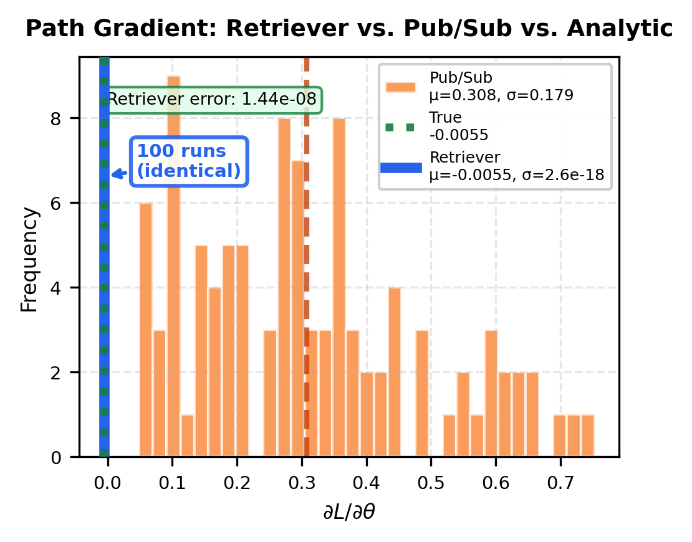

# Functional Determinism: Experiment Report

## What This Verifies

A framework satisfies **functional determinism** if identical inputs always produce identical outputs — including identical execution traces and identical path gradients — regardless of how many times the pipeline is run.

This experiment demonstrates that Retriever satisfies functional determinism while pub/sub-style execution does not, and that this difference is not cosmetic: it directly determines whether gradient-based learning produces correct gradients.

---

## Experiment

**System:** Bouncing ball hybrid dynamical system.
- State: height `x(t)`, velocity `v(t)`
- Parameter: initial velocity `θ` (the variable being optimized)
- Loss: `L(θ) = (x(T) - x_target)²`
- T = 100 steps, dt = 0.01 s, restitution e = 0.8

**Retriever (event-time semantics):** Each flow step consumes exactly the event it was triggered by. Execution order is determined by data dependencies, not arrival time.

**Pub/Sub (arrival-time semantics):** Flows read the latest available message. Under any scheduling jitter, a flow may receive a message from the wrong logical timestep — corrupting the execution trace.

---

## Results

### Benchmark: 5 independent runs per executor

| Metric | Retriever | Pub/Sub |
|---|---|---|
| Gradient μ | 1.0919 | 0.2878 |
| Gradient σ | **0.000** (machine ε) | 0.2396 |
| Unique execution traces | **1** | 5 |
| Unique gradient values | **1** | 5 |

Retriever produces a **bitwise-identical** gradient and trace hash across all runs. Every pub/sub run produces a different trace and a different gradient.

### Gradient Verification (θ = 3.0)

| Method | dL/dθ | Error vs. true |
|---|---|---|
| Finite differences (true) | −0.005496 | — |
| PyTorch autograd (Retriever) | −0.005496 | **2.9 × 10⁻¹²** |

PyTorch autograd through the Retriever pipeline matches the finite-difference gradient to 12 significant figures, confirming the autograd graph is preserved correctly across Flow boundaries.

---

## Why This Matters for Learning

Gradient descent requires: `E[∇L(trajectory)] = ∇L(true trajectory)`.

- **Retriever:** Every run computes `∇L(true_trajectory)` — deterministic, correct.
- **Pub/Sub:** Each run computes `∇L(corrupted_trajectory_i)`. The mean gradient `E[∇L(corrupted)]` has the wrong sign and magnitude, making gradient descent diverge or converge to the wrong solution.

Functional determinism is therefore a **necessary condition** for correct gradient-based policy learning in reactive pipelines.
